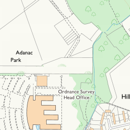
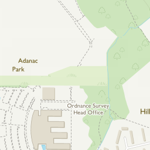
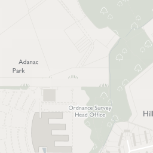
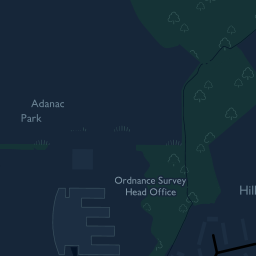

# Mapbox Adapter for OS Maps API
This is a simple `NSURLProtocol` subclass to provide a style json file that loads
the Ordnance Survey Maps API in to Mapbox GL.

### Getting Started
You will need an API key from Ordnance Survey to use this sample.
```
printf "your-api-key" > APIKEY
```
Please ensure your APIKEY file doesn't have a trailing new line.

You will also need to download the [latest](https://github.com/mapbox/mapbox-gl-native/releases) Mapbox framework. At time of writing,
Mapbox doesn't support Carthage, so installing the Mapbox framework is either a
manual process or requires CocoaPods.

### Using in your own project
Easiest way to use this framework is using carthage. Add
```
github "OrdnanceSurvey/os-mapbox-adapter"
```
to your Cartfile

## OSMapboxAdapter.framework
This framework contains a single public class, `OSMapsAPI`. There are two methods
to this class, `setAPIKey:`, which you should call with your OS Maps API key before
trying to use it, and `stylesheetURLForProduct:` which you should pass the result
of to your map view:

```
[OSMapsAPI setAPIKey:"my-api-key"];
self.mapView.styleURL = [OSMapsAPI stylesheetURLForProduct:OSBaseMapStyleRoad];
```

### How it works
To enable the protocol to be picked up by Mapbox's private `NSURLSession`, there's
a method swizzle in here to override `+[NSURLSessionConfiguration defaultSessionConfiguration]`
and return a version with `OSMapsStyleProtocol` inserted in the configuration's
`protocolClasses` property. If you'd rather not use method swizzling, you could
alternatively ship a style file as an asset in your app. There is a template
available [here](https://www.mapbox.com/ios-sdk/files/raster-v8.json) and you
simply need to add a URL template to the tiles array following the [OS Maps documentation](https://apidocs.os.uk/docs/os-maps-zxy)

### `OSBaseMapStyle`
The product options available. These products look like the tiles below:

`OSBaseMapStyleRoad`<br/>


`OSBaseMapStyleOutdoor`<br/>


`OSBaseMapStyleLight`<br/>


`OSBaseMapStyleNight`<br/>


### Limiting the map view to the bounds of the UK
The Mapbox SDK doesn't currently support limiting the map to the bounds of the UK,
however there are issues being tracked on GitHub so this will hopefully be available
soon. See [#3602](https://github.com/mapbox/mapbox-gl-native/issues/3602) and [#2457](https://github.com/mapbox/mapbox-gl-native/issues/2457)
and [#2341](https://github.com/mapbox/mapbox-gl-native/pull/2341).

### License
This framework is released under the [Apache 2.0 License](LICENSE)
The Mapbox SDK is released under the [BSD License](https://github.com/mapbox/mapbox-gl-native/blob/master/LICENSE.md)
